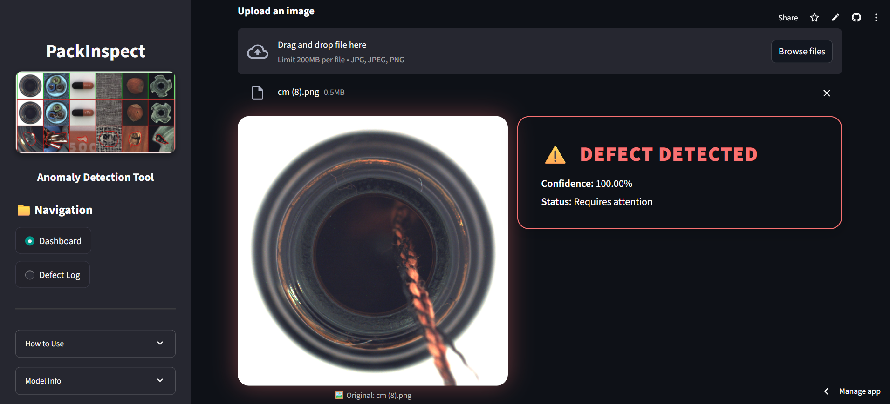

# PACKINSPECT-ANOMALY-DETECTOR

_Detects Defects, Ensures Quality, Accelerates Innovation_


Built with the tools and technologies:  


---

## Table of Contents

- [Overview](#overview)
- [Features](#features)
- [Getting Started](#getting-started)
  - [Prerequisites](#prerequisites)
  - [Installation](#installation)
  - [Usage](#usage)
  - [Testing](#testing)
- [License](#license)
- [Screenshots](#screenshots)

---

## 📌 Overview

**PackInspect** is a low-code visual inspection tool built using **TensorFlow** and **Streamlit**. It allows users to detect defects in bottle images (or similar packaging components) by uploading images or capturing them via webcam.

It's designed to streamline quality assurance in **smart manufacturing**, reduce manual errors, and provide real-time feedback using deep learning.

---

## 🚀 Features

- 📤 **Upload or Capture Images**  
  Choose between uploading images or capturing directly using a webcam.

- 🤖 **AI-Based Classification**  
  Classifies images as `Good` or `Defect` using a pre-trained Keras model.

- 📈 **Confidence Display**  
  Shows prediction confidence scores for transparency.

- 🧾 **Detection History Log**  
  View recent predictions with timestamps and export results to CSV.

- 📊 **Pie Chart Summary**  
  Visual overview of detection distribution (Good vs. Defect).

- 🧪 **Interactive Sidebar**  
  Includes collapsible guides, model info, and accuracy stats.

---

## 🛠 Tech Stack

- **Frontend/UI**: Streamlit, HTML/CSS (Custom Styling)
- **Machine Learning**: TensorFlow + Keras
- **Image Processing**: OpenCV, Pillow
- **Data Handling**: NumPy, Pandas
- **Visualization**: Streamlit charts

---

## 📂 Project Structure

packinspect-anomaly-detector/
│
├── app.py # Main Streamlit application
├── models/
│ └── keras_model.keras # Pre-trained ML model
├── data/
│ └── labels.txt # Contains 'Good' and 'Defect'
├── assets/
│ └── overview_dataset.jpg # Sidebar visual banner
├── requirements.txt # Python dependencies
├── logs/
│ └── defect_log.csv # Detection history log
└── README.md # Project documentation (this file)

---

## 🧰 Getting Started

### 1. Clone the Repository

```bash
git clone https://github.com/devaldaki3/packinspect-anomaly-detector.git
cd packinspect-anomaly-detector
```

### 2. Install Requirements

```bash
pip install -r requirements.txt
```

### 3. Run the Application

```bash
streamlit run app.py
```

Open your browser at [http://localhost:8501](http://localhost:8501)

---

## 🎯 Model

The application uses a binary classification model trained via Google Teachable Machine and exported in .keras format.

- **Input shape:** 224x224 RGB
- **Output:** Sigmoid (binary classification)
- **Classes:** Good, Defect

---

## 📈 Analytics

- Pie chart showing Good vs. Defect count
- Optional: Extend with bar graphs or trend charts using Streamlit/Pandas

---

## 📤 Export Options

- ✅ Download detection history as a CSV report
- 🔄 Can be extended to store results in a cloud database

---

## 📃 License

This project is licensed under the MIT License.
You can use, modify, and distribute it freely with proper attribution.

---

## ✨ Author

Developed with ❤️ by [@devaldaki3](https://github.com/devaldaki3)

Feel free to contribute, raise issues, or suggest improvements.

## 📸 Screenshots

**Dashboard**


**Prediction Result**


---
